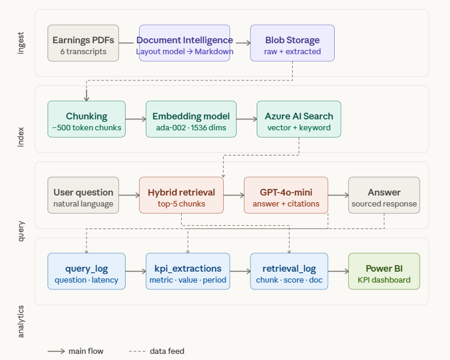

# Earnings Call Intelligence Pipeline

An end-to-end RAG (Retrieval-Augmented Generation) system that extracts
insights from public earnings call transcripts using Azure AI services.

## Problem

Earnings call transcripts contain critical financial signals buried in
dense unstructured text. Analysts spend hours reading transcripts to
extract KPIs, risk factors, and guidance. This pipeline automates that
extraction and makes transcripts queryable in natural language.

## Architecture

```
PDF Transcripts
      ↓
Azure Document Intelligence (Layout model)
      ↓
Azure Blob Storage (markdown)
      ↓
Azure AI Search (hybrid vector + keyword + semantic re-ranking)
      ↓
Azure OpenAI gpt-4o-mini (answer generation)
      ↓
Azure SQL Serverless (query logging + KPI extraction)
      ↓
Power BI (analytics dashboard)
```



## Tech Stack

| Layer | Service |
|---|---|
| Document parsing | Azure Document Intelligence (Layout model) |
| Vector storage | Azure AI Search (hybrid search + semantic ranking) |
| Embeddings | Azure OpenAI text-embedding-ada-002 |
| Generation | Azure OpenAI gpt-4.1-mini |
| Analytics | Azure SQL Database (Serverless) |
| Dashboard | Power BI |

## Key Features

- Hybrid search combining vector similarity and keyword matching
- Semantic re-ranking via Azure AI Search cross-encoder model
- Source citation on every answer
- Full query logging with latency tracking
- Automated KPI extraction from LLM responses into structured SQL
- Power BI dashboard showing retrieval quality and extracted financials

## How to Run

1. Clone the repo
2. Copy `.env.example` to `.env` and fill in your Azure credentials
3. Upload PDFs to the `transcripts` blob container
4. Run in order:

```bash
pip install azure-ai-documentintelligence azure-storage-blob azure-search-documents openai python-dotenv pyodbc

python extract_documents.py
python chunk_documents.py
python create_index.py
python index_chunks.py
python setup_database.py
python test_rag.py
python extract_kpis.py
python chat.py
```

## Project Structure

```
├── extract_documents.py   # PDF → Markdown via Document Intelligence
├── chunk_documents.py     # Markdown → chunks for indexing
├── create_index.py        # Create AI Search index schema
├── index_chunks.py        # Embed and upload chunks to AI Search
├── setup_database.py      # Create SQL analytics tables
├── rag.py                 # Core RAG library
├── test_rag.py            # Batch validation test
├── chat.py                # Interactive CLI
├── extract_kpis.py        # Structured KPI extraction into SQL
├── analysis_queries.sql   # SQL queries for Power BI
└── .env.example           # Credential template
```

## Cost

Total build cost: under $20 using Azure free tiers and pay-as-you-go pricing.
